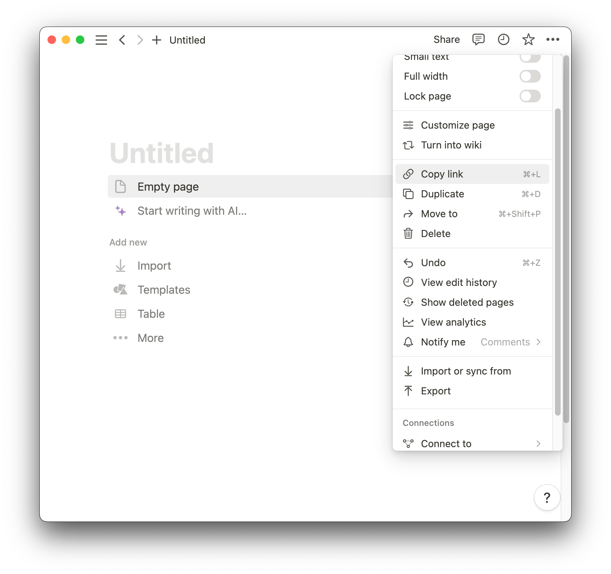

# HKU Moodle Events to Notion Database

This scrapper script retreives user's HKU Moodle Events (Assignments Deadlines), and auto update the events on a Notion Database.
<div display="inline">
  
  <span>:arrow_right:</span>
   
</div>

  
### Step 1

Create an .env file and fill in your **HKU email** and **Portal PIN number**. You will also need your **Notion Token** and The **Notion Page ID** depending on where you want to place the database

```bash
#.env
EMAIL = ""
PORTAL_PIN = ""
NOTION_TOKEN = ""
NOTION_PAGE_ID = ""
```

* To find your Notion Token goto: https://www.notion.so/my-integrations . Create an new intergration and copy the **Internal Integration Secret**

<div display="flex">


</div>

* To find the Page ID of your desired Notion Page, go to the page and copy its link

<div display="flex">


</div>

  * E.g. The page_id of https://www.notion.so/chen-xiang/Test-fd292c99909f46e3b5ad3c3164a9213b?pvs=4 is **fd292c99909f46e3b5ad3c3164a9213b**
  * Also remember to Connect your page to your intergration

### Step 2

* Run the script using:

  ```shell
  ./run.sh
  ```
